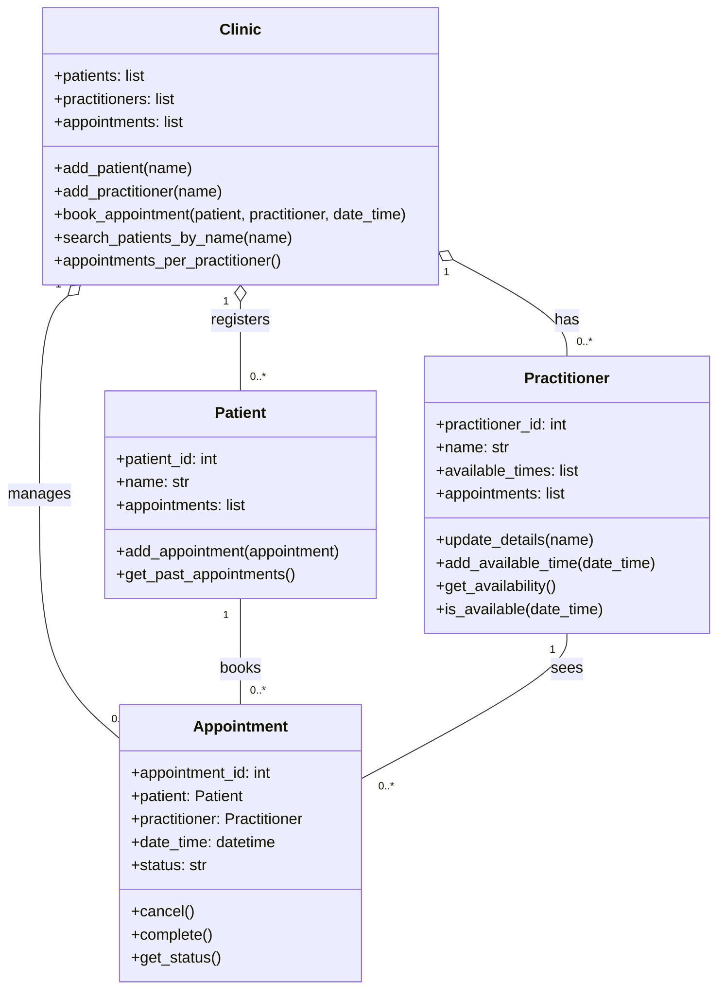

# Assignment 2 - Case Study

## Stage 3 Lab Activities

**SmartCare Domain Modelling**

AI OFF -\> AI ON -\> COMPARE -\> VERIFY \| 1 hour

# A - Requirements Review

Highlight nouns, verbs and business rules in SmartCare v0.2.

| Requirement | Noun | Verb | Business Rules |
|---|---|---|---|
| FR-01 | Patient, practitioner, time | Book, prevent | A GP can’t have two patients booked at the same time |
| FR-02 | Reception staff, patient | Add | None |
| FR-03 | Staff, practitioner, details | Add, update | None |
| FR-04 | Practitioner, availability | Display | None |
| FR-05 | Appointment, status | Record | Status can only be booked, cancelled or completed |
| FR-06 | Reception staff, appointment, time slot | Cancel, make available | When an appointment is cancelled, the slot opens up again |
| FR-07 | Reception staff, practitioner, patient, past appointments | View | None |
| FR-08 | Management, report, practitioner, appointments | Generate | Reports show how many appointments each GP has |
| FR-09 | Reception staff, appointment, patient, practitioner, time | Book | You can only book a time the GP is free |
| FR-10 | Reception staff, patient record, name | Search | None |
| NFR-02 | Appointment, status, users | Change, show | Everyone should see the same status straight away |
| US-01 (negative) | Receptionist, GP, appointment, message | Book, reject, show | If the slot is already taken, the booking is rejected and a message is shown |

# B - Candidate Classes

Record candidate concepts, supporting requirements, state and behaviour.

| Requirements | Concept | State/behaviour | Decision |
|---|---|---|---|
| FR-01 | Appointment, practitioner | State: date/time. Behaviour: check if GP is already booked at that time | Keep both as classes. The is an attribute, not its own class |
| FR-02 | Patient | State: ID, Name. Behaviour: add new patient | Class |
| FR-03 | Practitioner | State: ID, Name. Behaviour: update details | Class |
| FR-04 | Availability | State: list of free times on the GP. Behaviour: show availability | Attribute of practitioner, not a class |
| FR-05 | Status | State: booked, cancelled or completed. Behaviour: mark as completed, show status | Attribute of appointment, not a class |
| FR-06 | Appointment | State: status. Behaviour: cancel and free up the slot | Class |
| FR-07 | Past appointment | State: the patient’s appointments list. Behaviour: show past ones | Comes from patient, not a class |
| FR-08 | Report | Behaviour: count appointments for each GP | A method on clinic, not a class |
| FR-09 | Clinic | State: all patient’s, GPs and appointments. Behaviour: book an appointment | Optional class. Booking needs the patient, GP and the time together |
| FR-10 | Clinic | Behaviour: search patients by name. | Method on Clinic |

# C - CRC Cards

Create CRC cards for Patient, Practitioner and Appointment.

**Patient**

| Responsibilities                              | Collaborators |
|-----------------------------------------------|---------------|
| Keep the patient’s ID and name (FR-02, FR-10) | None          |
| Keep a list of their appointments             | Appointment   |
| Show their past appointments (FR-07)          | Appointment   |

**Practitioner**

| Responsibilities                                                   | Collaborators |
|--------------------------------------------------------------------|---------------|
| Keep the GP’s ID and Name, and update them when needed (FR-03)     | None          |
| Keep track of when the GP is free and show it (FR-04)              | None          |
| Check if the GP is already booked at a certain time (FR-01, FR-09) | Appointment   |
| Keep a list of the GP’s appointments (FR-08)                       | Appointment   |

**Appointment**

| Responsibilities                                                  | Collaborators         |
|-------------------------------------------------------------------|-----------------------|
| Know which patient and GP it’s for, and the date and time (FR-09) | Patient, practitioner |
| Keep its status as booked, cancelled or completed (FR-05)         | None                  |
| Cancel itself and free up the GP’s time slot (FR-06)              | Practitioner          |
| Get marked as completed after the visit (FR-05)                   | None                  |

# D - UML Model

Draw classes, attributes, operations, associations and multiplicities.



# E - AI Design Review

Ask AI to suggest classes and relationships using only confirmed requirements; require supporting requirement IDs.

**Prompt I gave the AI:**

> Using only the confirmed requirements in SmartCare v0.2 (FR-01to FR-10, NFR-01 to NFR-04, US-01 to US-04), suggest classes and relationships for a simple clinic booking system. Give the requirement IDs that support each suggestion. Don’t use anything that’s provisional, out of scope or still an open question.

**What the AI suggested:**

| AI suggestions | Requirement IDs |
|---|---|
| Have patient, practitioner and appointment as the main classes | FR-02, FR-03, FR-05, FR-09 |
| Each appointment has one patient and one GP, and patient and GPs can have many appointments | FR-07, FR08, FR-09 |
| Appointment status can only be booked, cancelled or completed | FR-05 |
| Cancelling an appointment should free up the GPs time slot | FR-06, US-03 |
| Add a clinic class that stores all the records and handles booking, searching, reports and user logins | FR-01, FR-08, FR-09, FR-10 |
| Make Timeslot its own class with a start time, end time and whether it’s booked | FR-04, FR-06 |
| Give patient extra details like phone, email, date of birth and address | FR-02 |
| Add a schedule class for each GP’s weekly working hours | FR-04 |
| Add a user class with a Receptionist, GP and Manager types, plus logins and permissions | FR-02, FR-07, FR-08 |
| Add a Report class to generate different kinds of reports | FR-08 |
| Add a Notification class to tell patients when an appointment is cancelled | US-03 |

# F - Compare and Decide

Record at least one accepted, modified and rejected AI suggestion.

| AI suggestions | Evidence | Decision | Reason | Model change |
|---|---|---|---|---|
| Patient, practitioner and appointment as main classes | FR-02, FR-03, FR-05, FR-09 | Accepted | I’d already picked these same in part B | Nothing they were already there |
| One patient and one GP per appointment, many appointments each | FR-07, FR-08, FR-09 | Accepted | Makes sense, an appointment is always one patient seeing one GP | Kept the 1 to 0..* links in my UML |
| Status is booked, cancelled or completed | FR-05 | Accepted | It’s exactly what FR-05 says | Left status as an attribute on appointment |
| Cancelling frees the time slot | FR-06, US-03 | Accepted | Both FR-06 and my US-03 criteria say this | Kept cancel() on appointment |
| Clinic class that also does user logins | FR-01, FR-08, FR-09, FR-10 | Modified | I agreed booking, search and reports need a class that can see everything, but nobody has asked for logins yet (open question 8) | Kept clinic, dropped the login part |
| TimeSlot as its own class | FR-04, FR-06 | Modified | Felt like too much for a small clinic. We only need to know if a time is free, and we still don’t know who sets GP hours (open question 2) | Used date_time on appointment and a list of free times on practitioner |
| Extra patient details like the phone and email | FR-02 | Modified | The only detail we actually know staff use is the name (FR-10, open question 4) | Just kept patient_id and name |
| Schedule class for working hours | FR-04 | Rejected | We don’t know yet who enters the hours (open question 2), so it’s too early | No change |
| Users class with roles and logins | FR-02, FR-07, FR-08 | Rejected | Staff use the system, the system doesn’t need to store them. Logins aren’t confirmed either (open question 8) | No change |
| Reports class | FR-08 | Rejected | FR-08 just needs a count per GP, a whole class for that is overkill | Added appointments_per_practitioner() to clinic instead |
| Notification class | US-03 | Rejected | Reminders are still provisional, and I already said no to this in stage 2 | No change |

# G - Python Skeletons

Create simple Patient, Practitioner and Appointment class skeletons.

```python
class Patient:
    """A patient at the clinic (FR-02, FR-07, FR-10)."""

    def __init__(self, patient_id, name):
        """Sets up a new patient with an ID, a name and no appointments yet."""
        self.patient_id = patient_id
        self.name = name
        self.appointments = []

    def add_appointment(self, appointment):
        """Adds an appointment to this patient's list."""
        pass

    def get_past_appointments(self):
        """Gives back this patient's past appointments (FR-07)."""
        pass


class Practitioner:
    """A GP who works at the clinic (FR-03, FR-04, FR-08)."""

    def __init__(self, practitioner_id, name):
        """Sets up a new GP with an ID, a name, no free times and no appointments yet."""
        self.practitioner_id = practitioner_id
        self.name = name
        self.available_times = []
        self.appointments = []

    def update_details(self, name):
        """Updates the GP's details (FR-03)."""
        pass

    def add_available_time(self, date_time):
        """Adds a time when the GP is free (FR-04)."""
        pass

    def get_availability(self):
        """Gives back the times the GP is free (FR-04)."""
        pass

    def is_available(self, date_time):
        """Checks if the GP is free at a time so there's no double booking (FR-01, FR-09)."""
        pass


class Appointment:
    """One patient seeing one GP at a set time (FR-05, FR-06, FR-09)."""

    def __init__(self, appointment_id, patient, practitioner, date_time):
        """Sets up a new appointment. Every appointment starts off as booked."""
        self.appointment_id = appointment_id
        self.patient = patient
        self.practitioner = practitioner
        self.date_time = date_time
        self.status = "booked"  # can only be booked, cancelled or completed (FR-05)

    def cancel(self):
        """Cancels the appointment and frees up the GP's time slot (FR-06)."""
        pass

    def complete(self):
        """Marks the appointment as completed (FR-05)."""
        pass

    def get_status(self):
        """Gives back the current status (FR-05)."""
        pass


class Clinic:
    """Keeps all the patients, GPs and appointments in one place."""

    def __init__(self):
        """Sets up an empty clinic."""
        self.patients = []
        self.practitioners = []
        self.appointments = []

    def add_patient(self, name):
        """Adds a new patient (FR-02)."""
        pass

    def add_practitioner(self, name):
        """Adds a new GP (FR-03)."""
        pass

    def book_appointment(self, patient, practitioner, date_time):
        """Books an appointment, but only if the GP is free (FR-01, FR-09)."""
        pass

    def search_patients_by_name(self, name):
        """Finds patients by their name (FR-10)."""
        pass

    def appointments_per_practitioner(self):
        """Counts how many appointments each GP has (FR-08)."""
        pass
```

# H - Consistency Check

Check model-code consistency; do not implement full behaviour yet.

| UML class | Attributes match? | Operations match | Notes |
|---|---|---|---|
| Patient | Yes: Patient_id, name, appointments | Yes: add_appointment, get_past_appointments | Same as the diagram |
| Practitioner | Yes: practitioner_id, name, available_times, appointments | Yes: update_details, add_available_ time, get_availability, is_available | Same as the diagram |
| Appointment | Yes: appointment_id, patient, practitioner, date_time, status | Yes: cancel, complete, get_status | Status start as “booked”, which fits FR-05 |
| Clinic | Yes: patient, practitioner, practitioner, appointments | Yes: add_patient, add_practitioner, book_appointment, search_patients_by_name, appointments_per_practitioner | Same as the diagram |

| UML relationship | How it shows in the code | Consistent? |
|---|---|---|
| Patient 1 to 0..* appointment | Patient has a list of appointments, and each appointment stores one patient | Yes |
| Practitioner 1 to 0..* appointment | Practitioner has a list of appointments, and each appointment stores one GP | Yes |
| Clinic 1 to 0..* patient, practitioner and appoinment | Clinic keeps a list of each | Yes |

# Reflection

What modelling decision was hardest? Where did AI over-design? What evidence supported your final choices?

**What modelling decision was hardest?**  
Honestly, figuring out where booking should go. Booking needs the patient, the GP and the time all at once, plus a check that the GP isn't already booked (FR-01). It didn't really belong to just one of my three classes, so I ended up adding a small Clinic class to handle booking, searching (FR-10) and reports (FR-08). I was a bit worried it would turn into a class that does everything, so I kept it small. I also couldn't decide at first if a time slot should be its own class. In the end I just made it an attribute, since FR-04 and FR-06 only care whether a time is free or not.

**Where did AI over-design?**  
The AI went a bit overboard. It wanted a User class with logins and roles, a Schedule class, a Report class and even a Notification class. None of that is in the confirmed requirements. Logins and GP hours are still open questions, the report is just a count, and reminders are only provisional anyway. It also tried to add phone, email and address to Patient, which the clinic never asked for.

**What evidence supported my final choices?**  
I mostly just kept asking myself "which requirement says this?" If I couldn't point to an FR, NFR or US ID, I didn't keep it. Anything that depended on an open question got left out until the clinic answers it. At the end I compared my code with the UML diagram to make sure they matched
