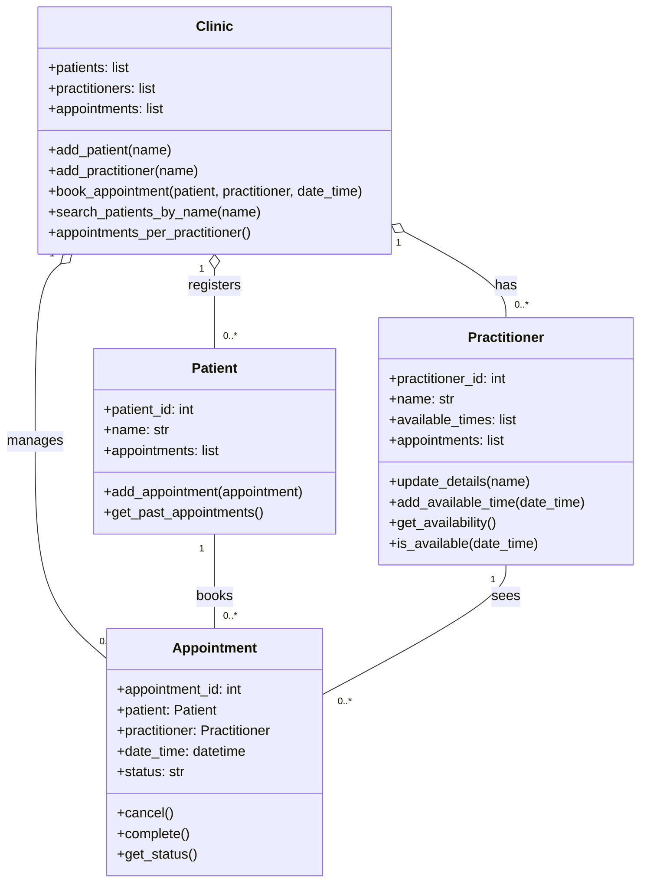

# SmartCare v0.3 - Domain Model Workbook

Week 6 student resource

# Requirement-to-Concept Trace

| Requirement | Concept                   | State/behaviour                                                                  | Decision                                                        |
|-------------|---------------------------|----------------------------------------------------------------------------------|-----------------------------------------------------------------|
| FR-01       | Appointment, practitioner | State: date/time. Behaviour: check if the GP is already booked at that time      | Keep both as classes. The time is just an attribute             |
| FR-02       | Patient                   | State:ID, name. Behaviour: add a new patient                                     | Class                                                           |
| FR-03       | Practitioner              | State:ID, name. Behaviour: update details                                        | Class                                                           |
| FR-04       | Availabilty               | State: list of free times on the GP. Behaviour: mark as completed, show status   | Attribute of practitioner, not a class                          |
| FR-05       | Status                    | State: booked, cancelled or completed. Behaviour: mark as completed, show status | Attribute of appointment, not a class                           |
| FR-06       | Appointment               | State: status. Behaviour: cancel and free up the slot                            | Class                                                           |
| FR-07       | Past appointments         | State: the patient’s appointment list. Behaviour: show past ones                 | Comes from patient, not a class                                 |
| FR-08       | Report                    | Behaviour: count appointments for each GP                                        | A method on clinic, not a class                                 |
| FR-09       | Clinic                    | State: all patients, GPs and appointments. Behaviour: book an appointment        | Optional class. Booking needs the patient, GP and time together |
| FR-10       | clinic                    | Behaviour: search patients by name                                               | Method on clinic                                                |

# CRC Cards

## Patient

| Responsibilities                                   | Collaborators |
|----------------------------------------------------|---------------|
| Keep the patient’s ID and name (FR-02, FR-10)      | None          |
| Keep their appointments and show past ones (FR-07) | Appointments  |

## Practitioner

| Responsibilities                                                                       | Collaborators |
|----------------------------------------------------------------------------------------|---------------|
| Keep the GP’s ID and name, and update them when needed (FR-03)                         | None          |
| Keep track of when the GP is free and check if a time is already booked (FR-01, FR-04) | Appointments  |

## Appointment

| Responsibilities                                                                                   | Collaborators         |
|----------------------------------------------------------------------------------------------------|-----------------------|
| Know which patient and GP it’s for, and the date and time FR-09)                                   | Patient, practitioner |
| Keep its status (booked, cancelled or completed), and free up the slot if cancelled (FR-05, FR-06) | Practitioner          |

## Optional class

| Responsibilities                                                                                            | Collaborators                       |
|-------------------------------------------------------------------------------------------------------------|-------------------------------------|
| Keep all the patients and GPs, add new ones and search patients by name ( FR-02, FR-03, FR-10)              | Patient, practitioner               |
| Book appointments only when the GP is free, and count appointments per GP for reports (FR-01, FR-08, FR-09) | Patient, practitioner, appointment. |

# UML Class Diagram

Insert/draw UML here. Include defensible relationships and multiplicities.

# Design Rationale

Explain class selection, responsibility allocation and key relationships.

**Class selection**  
The three main classes are pretty obvious: Patient, Practitioner and Appointment. They're the main things the clinic needs to keep track of (FR-02, FR-03, FR-05, FR-09). I also added a small Clinic class, because things like booking, searching for patients and reports need to look at everyone, not just one patient or one GP (FR-01, FR-08, FR-10). I thought about making time slots, status and reports into their own classes, but they're really just details or results, so attributes and methods made more sense. I didn't make reception staff or management into classes either. They're just people using the system, and we don't even know yet if there'll be logins (Open Question 8).

**Responsibility allocation**  
Basically, I gave each job to whichever class already had the information for it. Patient looks after its own details and past appointments (FR-07). Practitioner knows when the GP is free and can check if a time is already taken (FR-01, FR-04). Appointment handles its own status and cancelling, which frees up the slot again (FR-05, FR-06). Anything that needs the bigger picture, like booking, searching by name or counting appointments per GP, went to Clinic (FR-08, FR-09, FR-10).

**Key relationships**  
An appointment is always one patient seeing one GP, but a patient or GP can have loads of appointments, or none yet. That's why both of those links are 1 to 0..*. Clinic holds everything together, so I used aggregation (the hollow diamond) for that. Overall I kept it small on purpose, since the brief says the clinic wants something simple and easy to maintain, not a big hospital system.

# AI Design Review Record

| AI suggestion | Evidence | Decision | Reason | Model change |
|---|---|---|---|---|
| One patient and one GP per appointment, with many appointments each | FR-07, FR-08, FR-09 | Accepted | Makes sense, an appointment is always one patient seeing one GP | Kept the 1 to 0..* links in my UML |
| Clinic class that also does user logins | FR-01, FR-08, FR-09, FR-10 | Modified | I agreed booking, search and reports need a class that can see everything, but nobody has asked for logins yet (open question 8) | Kept clinic, dropped the login part |
| TimeSlot as its own class | FR-04, FR-06 | Modified | Felt like too much for a small clinic. We only need to know if a time is free, and we still don’t know who sets GP hours (open question 2) | Used date_time on appointments and list of free times on practitioner |
| User class with roles and logins | FR-02, FR-07, FR-08 | Rejected | Staff use the systems, the system doesn’t need to store them. Logins aren’t confirmed either (open question 8) | No change |
| Report class | FR-08 | Rejected | FR-08 just needs a count per GP, a whole class for that is overkill | Added appointments_per_practitioner() to clinic instead |
