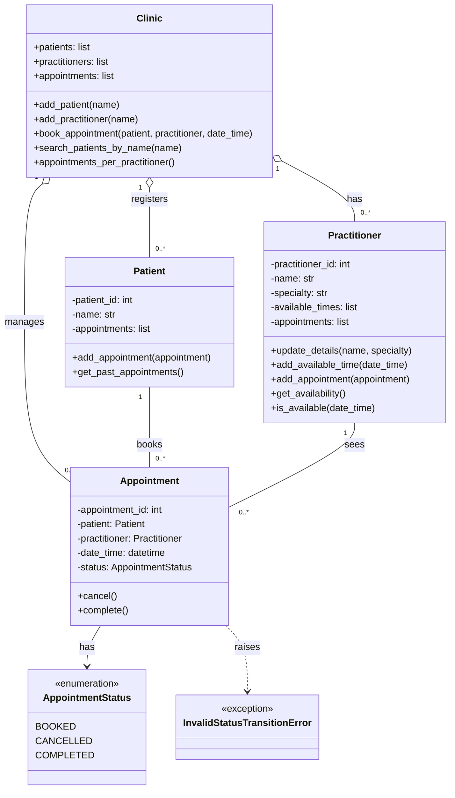

# SmartCare v0.4 - Domain Implementation Workbook

Week 7 student resource

# 1. UML-to-Code Trace

| UML element | Python element | Implemented? | Notes |
|---|---|---|---|
| Patient class | Class patient | Yes | ID and name get checked, and everything’s private with Read-only properties |
| Practitioner class | Class practitioner | Yes | Added specialty because the lab asked for it (FR-03) |
| Appointment class | Class appointment | Yes | Starts as booked and doesn’t do any booking Itself, that’s clinic’s job |
| Appointment.status: str | Appointmentstatus enum + status property | Yest, but changed | Changed from a string to an enum so it can only be BOOKED, CANCELLED, or COMPLETED (FR-05) |
| Cancel() and complete() | Appointment.cancel(), Appointment.complete() | Yes | Only work if the appointment is still BOOKED, otherwise they throw an error |
| get_status() | Status property instead | No, removed | Did the same thing as the property so I took it out in the refactor |
| Patient.get_past_appoint ments() | Patient.get_past_appoint ments() | Yes | Includes cancelled ones since it’s the patient’s history (FR-07) |
| Practitioner availability methods | add_available_time(), is_available(), get_availability() | Yes | Is_available() skips cancelled appointments, which is how the slot frees up (FR-06) |
| Patient and practitioner 1 To 0..* appointment | Appoitment stores its Patient and GP, and both Keep a private list with add_appointment() | Yes | Add_appointment() Checks the appointment actually belongs to them |
| Clinic class | Not written yet | No | The lab only asked for the three main classes this week, so clinic stays as a skeleton for now |

# 2. Domain Invariants

| Class | Invariant / rule | How protected |
|---|---|---|
| Patient | A patient always has a positive ID And a name that isn’t blank | Checked in the constructor with \_check_id() and \_check_text(), and both are read only after that |
| Patient | A patient’s list only has their own Appointments, with no doubles | The list is private and add_appointments() checks the appointment is for them and not already there |
| Practitioner | A GP always has a positive ID, a name and a specialty that aren’t blank | Checked when the GP is made, and update_details() uses the same checks so you can’t blank them later |
| Practitioner | A GP can’t have two active appointments at the same time (FR-01) | Is_available() returns False if someone’s already booked in at that time, unless that booking was cancelled |
| Appointment | Status can only be BOOKED, CANCELLED, or COMPLETED (FR-05) | It’s an enum, and it’s private with no setter, so it can’t be set to anything else |
| Appointment | Once cancelled or completed, the status can’t change again | Cancel() and completed() only work from BOOKED, otherwise they throw InvalidStatusTransitionError |

# 3. Composition / Inheritance Decisions

| Relationship | Decision | Rationale |
|---|---|---|
| Appointment and patient | Association | An appointment isn’t a kind of patient, it just points to one. Each apoointment has 1 patient, and a patient can have 0 or more appointments (FR-07, FR-09) |
| Appointment and practitioner | Association | Same thing, an appointment just knows which GP it's with. It doesn't own the GP and the GP doesn't disappear if an appointment gets cancelled (FR-01, FR-09) |
| Clinic and patient, practitioner, appointment | Aggregation (not written yet) | Clinic just keeps track of everything so it can do booking, searching and reports. The patients and GPs would still exist without it, so it's not composition |
| Patient and Practitioner (possible person parent class) | No inheritance | They both have an ID and a name, so I thought about a Person parent class. But that's all they share, and a parent class just for two attributes felt like too much. I used the shared \_check_id() and \_check_text() helpers instead |
| AppointmentStatus and InvalidStatusTransitionError | Inheritence from Python’s Enum and Exception | This is the only inheritance I used, and it's because Python needs it. An enum has to come from Enum, and a custom error has to come from Exception |

# 4. AI Pair-Programming Record

| AI contribution | Conforms? | Decision | Reason | Verification |
|---|---|---|---|---|
| Appointmentstatus enum with BOOKED, CANCELLED, COMPLETED | Yes, matches FR-05 | Accepted | Stops status from being any random string like it could in week 6 | Status started as BOOKED and only Changed to the other two in my part F tests |
| InvalidStatusTransitionError | Not in the UML, but fits the rules | Accepted | Makes it clear when someone tries an illegal status change | Cancelling twice and completing a cancelled appointment both gave this error |
| Private attributes with read-only properties | Partly, my UML had everything public | Accepted | Protecting status was the whole point, so this was a good change | Trying Appointment.status= BOOKED got blocked |
| Input checks in the constructor | Mostly | Modified | Let true and False through as IDs because python counts them as numbers | Found in part F, fixed With \_check_id() in part G, reran the tests and it passed |
| Both get_status and a status property | Yes, but doubled up | Modified | They did exactly the same thing, so one was extra code | Removed get_status() in part G, reran the tests and nothing broke |

# 5. Updated UML

Insert updated UML only if implementation revealed a justified design change. Explain every change.

What changed and why:

I made everything private (the - instead of +). In Week 6 it was all public, so any code could just change an appointment's status. Now you can only read the attributes, and status can only change through cancel() or complete().

Status is an enum now instead of a string. With a string it could be anything, even a typo, but now it can only be BOOKED, CANCELLED or COMPLETED (FR-05).

I added InvalidStatusTransitionError. The AI came up with this one and I kept it. It gets thrown when someone tries something that isn't allowed, like cancelling the same appointment twice.

I took out get_status() because it did the exact same thing as the status property, so it was just extra.

Practitioner has a specialty now, and update_details() can change it. The lab asked for it and it fits with FR-03 since that's about keeping GP details up to date.

I also gave Practitioner an add_appointment() method like Patient has. The GP needs its own list of appointments so is_available() can check for double bookings (FR-01).

Clinic is the same as Week 6 because I haven't written it yet.
