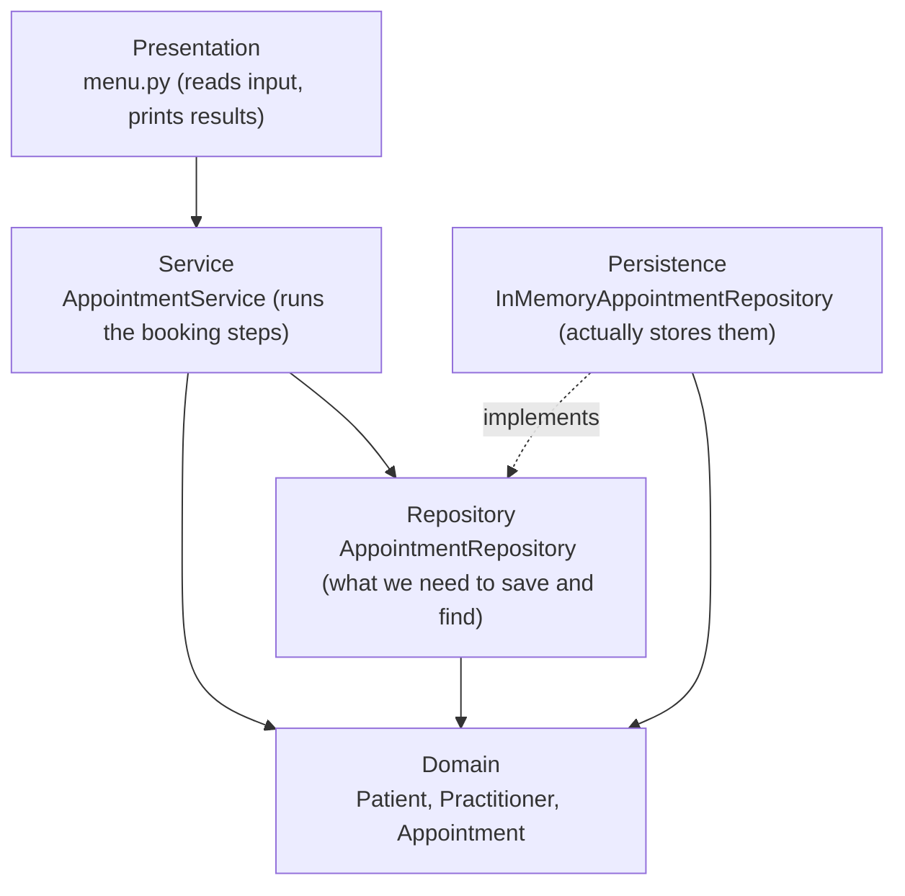

# Assignment 2- Case Study (8995-G level Task)

## Stage 5 Lab Activities

**Refactoring SmartCare into a Layered Architecture**

HUMAN ANALYSIS -> REFACTOR -> AI REVIEW -> VERIFY | 1 hour

# A - Inspect SmartCare v0.4

Identify domain, workflow, data-access and presentation responsibilities currently mixed together.

| Responsibility | Where it is now | Type | Problem |
|---|---|---|---|
| Checking IDs, names and status changes | Patient, Practitioner, Appointment | Domain | Nothing, this is where it should be |
| Booking an appointment (check the GP's free, make it, add it to both lists) | Not in any class, I did it by hand in manual_checks.py | Workflow | Easy to miss a step, like forgetting is_available() and double booking someone |
| Printing stuff out | print() in manual_checks.py | Presentation | All mixed in with the setup and testing code |
| Storing appointments | Lists inside Patient and Practitioner | Data access | Same appointment is saved twice, can't look one up by ID, and it's all gone when the program closes |
| Giving out IDs | Whoever makes the object types in the ID | Data access | Nothing stops two appointments having the same ID |
| Clinic class (planned) | Week 6 skeleton with booking, searching and reports | Everything at once | Would turn into one big class that does everything |

Going back over v0.4, the three main classes were actually fine. Patient, Practitioner and Appointment just look after their own stuff, so I don't really need to touch them. The mess is more around them.

The biggest thing is that booking doesn't really live anywhere. In my test script I had to make the appointment, then add it to the patient, then add it to the GP, all by hand. If you forget to check is_available() first, you can double book a GP and nothing stops you. That same script also sets everything up, runs it and prints it all in one go, so it's doing way too many jobs.

Storing things is a bit dodgy too. Appointments are just sitting in lists inside Patient and Practitioner, so each one gets saved in two places. There's no way to find one by its ID, and once the program closes it's all gone. IDs are typed in by hand as well, so two appointments could easily end up with the same one.

Then there's my Clinic skeleton from Week 6. The plan was for it to do booking, searching and reports, which would basically make it one giant class that does everything. That's pretty much what this week is trying to get me to avoid.

# B - Propose Architecture

Draw Presentation -> Service -> Domain, with Service using a Repository abstraction and Persistence implementing it.



I've split SmartCare into five layers. Each arrow just means "uses", and they all point down towards the domain. The domain classes don't know anything about the layers above them, which is the main thing I wanted.

The menu is at the top. All it does is read what the user types and print stuff back. Anything else gets handed to AppointmentService, which is where the booking steps go now, like checking the GP's free, making the appointment and saving it. So I'm not doing that by hand anymore.

The actual rules, like cancel() and complete(), stay in Appointment where they were. The service just calls them. When it needs to save or find an appointment, it goes through AppointmentRepository, which is basically a short list of what I need to do with stored appointments. The service doesn't care how they're actually stored.

The storing happens in the persistence layer. Right now it's just kept in memory, because that's all SmartCare needs at this point. If I switch to a proper database later, I'd only have to write a new persistence class, and nothing else would need to change.

# C - Create Package Structure

Create domain/, services/, repositories/, persistence/ and presentation/ or a justified equivalent.

```text
smartcare/
├── domain/
│   ├── patient.py
│   ├── practitioner.py
│   ├── appointment.py
│   ├── status.py          (AppointmentStatus + InvalidStatusTransitionError)
│   └── validation.py      (check_id, check_text)
├── services/
│   └── appointment_service.py
├── repositories/
│   └── appointment_repository.py
├── persistence/
│   └── in_memory_appointment_repository.py
└── presentation/
    └── menu.py
main.py
```

I set up the five folders from the handout, one for each layer. The domain folder is just my v0.4 code split into separate files, and I didn't change how anything works. I put the status enum in its own file so the imports don't go in circles. main.py sits outside all of them and just connects everything when the program starts.

# D - Introduce AppointmentService

Move workflow coordination into a focused service without stealing Appointment domain behaviour.

```python
"""Service layer: runs the booking steps in the right order. The actual rules stay in the domain classes."""
from __future__ import annotations
from datetime import datetime
from smartcare.domain import Appointment, Patient, Practitioner
from smartcare.repositories import AppointmentRepository


class AppointmentService:
    """Coordinates booking, cancelling and completing appointments (FR-01, FR-05, FR-06, FR-09)."""

    def __init__(self, repository: AppointmentRepository) -> None:
        self._repository = repository

    def book_appointment(self, patient: Patient, practitioner: Practitioner, date_time: datetime) -> Appointment:
        """Books an appointment, but only if the GP is free at that time (FR-01, FR-09)."""
        if not practitioner.is_available(date_time):
            raise ValueError("The GP isn't available at that time")
        appointment = Appointment(self._repository.next_id(), patient, practitioner, date_time)
        patient.add_appointment(appointment)
        practitioner.add_appointment(appointment)
        self._repository.add(appointment)
        return appointment

    def cancel_appointment(self, appointment_id: int) -> Appointment:
        """Finds the appointment and cancels it. Appointment decides if that's allowed (FR-06)."""
        appointment = self._find(appointment_id)
        appointment.cancel()
        return appointment

    def complete_appointment(self, appointment_id: int) -> Appointment:
        """Finds the appointment and marks it as completed. Appointment decides if that's allowed (FR-05)."""
        appointment = self._find(appointment_id)
        appointment.complete()
        return appointment

    def _find(self, appointment_id: int) -> Appointment:
        """Looks up an appointment, or raises an error if it doesn't exist."""
        appointment = self._repository.get_by_id(appointment_id)
        if appointment is None:
            raise LookupError(f"No appointment with ID {appointment_id}")
        return appointment
```

All the booking steps I used to do by hand are in one place now. The service checks the GP is free, makes the appointment, adds it to both lists and saves it, so nothing gets skipped. I was careful not to move any rules out of Appointment, though. The service only finds the appointment and calls cancel() or complete(), and Appointment still decides if that's allowed. IDs also come from the repository now, so they can't be typed in wrong.

# E - Repository Abstraction

Define a small AppointmentRepository contract using only current use-case needs.

**The Contact code**

```python
"""The contract for storing and finding appointments. Only has what the current use cases need."""
from __future__ import annotations
from abc import ABC, abstractmethod
from smartcare.domain import Appointment


class AppointmentRepository(ABC):
    """What the service needs to do with stored appointments. It doesn't say how they're stored."""

    @abstractmethod
    def next_id(self) -> int:
        """Gives back an ID that no other appointment is using yet."""

    @abstractmethod
    def add(self, appointment: Appointment) -> None:
        """Saves a new appointment."""

    @abstractmethod
    def get_by_id(self, appointment_id: int) -> Appointment | None:
        """Finds an appointment by its ID, or gives back None if there isn't one."""
```

**The version that** **actually stores** **the code**

```python
"""Persistence layer: keeps appointments in memory for now."""
from __future__ import annotations
from smartcare.domain import Appointment
from smartcare.repositories import AppointmentRepository


class InMemoryAppointmentRepository(AppointmentRepository):
    """Stores appointments in a dictionary, keyed by ID. Everything is lost when the program closes."""

    def __init__(self) -> None:
        self._appointments: dict[int, Appointment] = {}
        self._last_id = 0

    def next_id(self) -> int:
        self._last_id += 1
        return self._last_id

    def add(self, appointment: Appointment) -> None:
        if appointment.appointment_id in self._appointments:
            raise ValueError("An appointment with that ID is already saved")
        self._appointments[appointment.appointment_id] = appointment

    def get_by_id(self, appointment_id: int) -> Appointment | None:
        return self._appointments.get(appointment_id)
```

I kept the repository really small, with only three methods, because that's all the service actually uses. Booking needs a new ID and a way to save, and cancelling and completing need to find an appointment by its ID. I didn't add things like delete or list all, since nothing needs them yet. The in-memory version keeps appointments in a dictionary, which is enough for now. If SmartCare needs a real database later, I'd just write another class that follows the same contract.

# F - AI Architecture Review

Ask AI to review dependency direction, misplaced responsibilities and unnecessary complexity; request simplest justified improvements.

**Prompt I gave the AI:**

Act as a software architecture reviewer. Review this small SmartCare Python system against separation of concerns, cohesion, coupling and introductory SOLID principles. Identify concrete layer violations and dependency risks. Prefer the simplest refactoring that solves an observed problem. Do not introduce frameworks, microservices or patterns unless current requirements justify them.

**What the AI suggested:**

1. **Nothing actually uses the service yet.** There's no menu and no main.py, so the presentation layer only exists on the diagram. Add a small menu and a main.py that creates the repository and service and connects them.

2. **Appointments are now stored in three places:** the patient's list, the GP's list and the repository. Consider removing the lists from Patient and Practitioner and asking the repository instead.

3. **The service uses general errors** (ValueError, LookupError), so the menu can't easily tell them apart. Consider custom exceptions like SlotUnavailableError.

4. **get_past_appointments() calls** **datetime.now() inside the domain.** That hides a dependency and makes it hard to test. Let the current time be passed in, with now as the default.

5. **There's no way to look up patients or GPs by ID.** Consider a PatientRepository and a PractitionerRepository.

6. **Add an interface for AppointmentService too,** so the menu depends on an abstraction.

I gave the AI my new code with the suggested prompt, and it came back with six suggestions. Most of them pointed at real problems, especially the first one, since my presentation layer didn't actually exist yet. A couple felt like more than SmartCare needs right now, though. I decide what to do with each one in Part G

# G - Refactor and Verify

Apply only justified changes and confirm required behaviour remains unchanged.

| # | Suggestion | Decision | Why |
|---|---|---|---|
| 1 | Add a menu and main.py | Accepted | The presentation layer was just a box on my diagram, nothing was actually using the service |
| 2 | Take the appointment lists out of Patient and Practitioner | Deferred | is_available() needs the GP's list, so I'd be rewriting code that already works. Makes more sense once there's a real database |
| 3 | Custom exceptions like SlotUnavailableError | Modified | I didn't add new error classes. The menu just catches the errors I've already got and shows a nicer message |
| 4 | Pass the current time into get_past_appointments() | Accepted | Tiny change and it makes it way easier to test. It still uses the real time if you don't give it one |
| 5 | Patient and GP repositories | Deferred | You can't add patients or GPs from the menu yet, so main.py just sets up a few sample ones for now |
| 6 | An interface for AppointmentService | Rejected | There's only one service, so an interface would just be an extra file for no reason |

**main.py:**

```python
"""Starts SmartCare v0.5. Creates each layer and connects them. This is the only place that knows about all of them."""
from datetime import datetime
from smartcare.domain import Patient, Practitioner
from smartcare.persistence import InMemoryAppointmentRepository
from smartcare.presentation import Menu
from smartcare.services import AppointmentService


def main() -> None:
    repository = InMemoryAppointmentRepository()
    service = AppointmentService(repository)
    # Sample data for now, since there's no way to add patients or GPs from the menu yet
    patients = {1: Patient(1, "Sara Khan"), 2: Patient(2, "Tom Walker")}
    gp = Practitioner(1, "Dr Amy Lee")
    for hour in (9, 10, 11):
        gp.add_available_time(datetime(2026, 10, 5, hour, 0))
    practitioners = {1: gp}
    Menu(service, patients, practitioners).run()


if __name__ == "__main__":
    main()
```

**Changed** **get_past_appointments() in domain/patient.py:**

```python
    def get_past_appointments(self, now: datetime | None = None) -> list[Appointment]:
        """Gives back appointments that have already happened, including cancelled ones (FR-07).
        The current time can be passed in, which makes this easy to test. It uses the real time if not."""
        if now is None:
            now = datetime.now()
        return [a for a in self._appointments if a.date_time < now]
```

**Checks after the changes:**

| Check | Result |
|---|---|
| Bad patients (ID 0, blank name, text ID, True as ID) get rejected | Pass |
| Booking through the service starts as BOOKED and gets its ID from the repository | Pass |
| GP isn't free while booked, and a double booking gets blocked | Pass |
| Cancelling works, the GP's free again, and the cancelled one stays in the history | Pass |
| Can't cancel twice or complete a cancelled appointment | Pass |
| Can't change the status directly | Pass |
| Slot can be booked again after a cancel, with a new ID | Pass |
| Completing works through the service, and a made-up ID gets rejected | Pass |
| get_past_appointments() works when I give it a set time | Pass |
| Domain doesn't import anything from the other layers | Pass |
| Menu handles booking, showing free times, double booking, cancelling and bad input | Pass |

I only changed things that fixed an actual problem. The big one was adding the menu and main.py, since my presentation layer didn't really exist before. I also let get_past_appointments() take the current time so it's easier to test. A few suggestions I left for later, like getting rid of the duplicate lists and adding patient and GP repositories, because they'd mean redoing code that works fine right now. After that I wrote verify_v05.py to run all my old v0.4 checks through the new service, plus some new ones. Everything passed, so nothing broke.

# H - Reflection

Document one AI suggestion accepted, one modified and one rejected/deferred.

**Accepted:** The one I agreed with straight away was adding the menu and main.py. When the AI said nothing was actually using my service, I realised it was right. My presentation layer was literally just a box on the diagram. Once I added the menu and main.py, the layers actually worked together, and the menu only handles typing stuff in and printing stuff out, not any of the booking rules.

**Modified:** The AI wanted me to make custom errors like SlotUnavailableError so the menu could tell them apart. I kind of got why, but it felt like overkill for SmartCare right now. All the menu really needs to do is show a decent message when something goes wrong, so I just made it catch the errors I already had and print something friendly. Same result, way less code.

**Rejected / deferred:** I said no to making an interface for AppointmentService. There's only one service and nothing needs to swap it out, so it'd just be another file sitting there doing nothing. I also left the duplicate appointment lists in Patient and Practitioner for now. The AI had a point, since the same appointment is saved in three places, but is_available() needs the GP's list to work. Changing that now would mean redoing code that already works fine, so I'd rather do it when SmartCare actually gets a proper database.

Honestly the main thing I got out of this week is that the simplest fix is usually the best one. The AI had some good ideas, but a few of them would've just made SmartCare more complicated than it needs to be.

# Suggested AI prompt

Act as a software architecture reviewer. Review this small SmartCare Python system against separation of concerns, cohesion, coupling and introductory SOLID principles. Identify concrete layer violations and dependency risks. Prefer the simplest refactoring that solves an observed problem. Do not introduce frameworks, microservices or patterns unless current requirements justify them.
