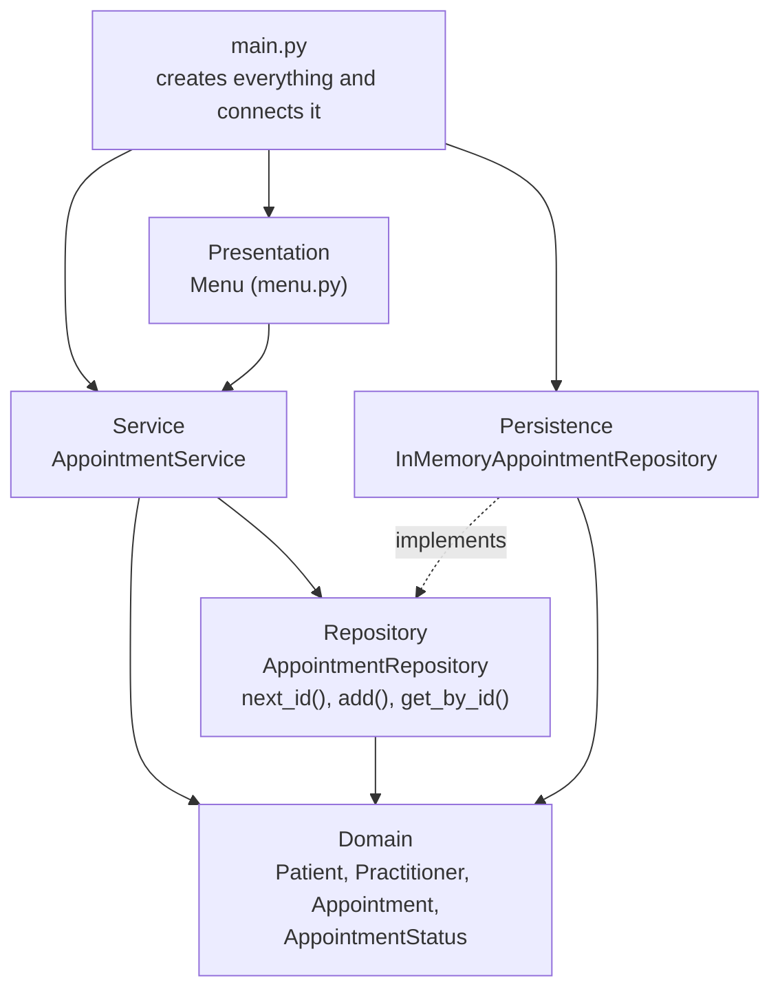

# SmartCare v0.5 - Architecture and Refactoring Workbook

Week 8 student resource

# Current Architecture Problems

| Problem | Evidence | Impact | Refactoring |
|---|---|---|---|
| Booking doesn't live anywhere | In manual_checks.py I had to make the appointment, then add it to the patient and the GP by hand | Easy to skip a step, like forgetting is_available() and double booking someone | Moved all the booking steps into AppointmentService.book_appointment() |
| Printing is mixed in with everything else | manual_checks.py sets things up, runs them and prints the results all in one script | Can't change what the user sees without touching the logic | Put all the input and printing in menu.py in the presentation layer |
| No way to find an appointment by ID | Appointments only sit in lists inside Patient and Practitioner | Cancelling or completing means digging through lists to find the right one | Added get_by_id() to AppointmentRepository |
| IDs are typed in by hand | Appointment(1, patient, gp, time), the ID is just whatever you pass in | Two appointments could end up with the same ID | The repository hands out IDs now with next_id() |
| Storage is stuck inside the domain | The only "storage" is the lists in Patient and Practitioner, and it's gone when the program closes | No way to swap to a real database later without rewriting the domain | Service talks to AppointmentRepository, and InMemoryAppointmentRepository does the storing for now |
| Clinic was going to do everything | My Week 6 Clinic skeleton had booking, searching and reports in one class | Would've turned into one massive class that changes for heaps of reasons | Dropped Clinic and split its jobs into the service and repository |
| Hidden dependency on the current time | get_past_appointments() calls datetime.now() inside the domain | Hard to test because the answer changes depending on when you run it | Let the current time be passed in, with the real time as the default |

# Layer Responsibilities

| Layer | Responsibilities | Must not contain |
|---|---|---|
| Presentation | Showing the menu, reading what the user types, turning it into IDs and dates, and printing results or friendly error messages | Booking rules, status rules, or any saving and finding of appointments |
| Service | Running the booking steps in the right order: check the GP's free, make the appointment, add it to both lists, save it. Also finding an appointment for cancel or complete | input() or print(), SQL or file stuff, or the actual status rules (those stay in Appointment) |
| Domain | Patient, Practitioner and Appointment, their data and rules, like checking IDs and names, status changes and whether a GP is free | Anything about menus, printing, databases, or imports from the other layers |
| Repository | The small contract for what the service needs to do with stored appointments: next_id(), add() and get_by_id() | How appointments are actually stored, or any booking logic |
| Persistence | Actually storing the appointments. Right now that's a dictionary in memory, later it could be a real database | Booking rules, status rules, or anything the user sees |

# Architecture Diagram

Insert SmartCare v0.5 architecture and dependency direction.

The arrows show which layer depends on which, and they all point down towards the domain. The domain doesn't depend on anything else. main.py is the only place that knows about every layer, because its job is just to create them and plug them together when the program starts. The dotted line means InMemoryAppointmentRepository follows the AppointmentRepository contract, so the service never has to know how appointments are actually stored.

# SOLID Review

| Principle | Relevant? | Evidence | Decision |
|---|---|---|---|
| SRP (Single Responsibility) | Yes, a lot | My test script and the planned Clinic class were doing heaps of jobs at once, like booking, storing, printing and reports | Split it up so each class has one job. The menu handles input and output, the service runs the booking steps, the repository stores stuff, and Appointment keeps its own rules |
| OCP (Open/Closed) | A bit | If I want a real database later, I can write a new class that follows AppointmentRepository without touching the service | Kept it at that. I didn't add plugins or extra layers just in case |
| LSP (Liskov Substitution) | Yes, but small | InMemoryAppointmentRepository stands in for AppointmentRepository, so it has to behave how the contract says, like get_by_id() giving back None when nothing's found instead of crashing | Any future database version has to follow the same rules so the service still works the same |
| ISP (Interface Segregation) | Yes | The repository only has next_id(), add() and get_by_id(), because that's all the service actually uses | Kept it tiny. No delete or list-all methods until something actually needs them |
| DIP (Dependency Inversion) | Yes, a lot | The service depends on the AppointmentRepository contract, not the in-memory class, and main.py is what plugs the real one in | Kept this. It's the main reason the domain and service don't care how appointments are stored |

# AI Architecture Review

| AI suggestion | Observed problem? | Decision | Reason | Verification |
|---|---|---|---|---|
| Add a menu and main.py | Yes, nothing was actually using the service, the presentation layer only existed on my diagram | Accepted | The layers weren't really real until something at the top used them | Ran the menu and tried booking, showing free times, a double booking, cancelling and bad input. All worked |
| Take the appointment lists out of Patient and Practitioner | Yes, the same appointment is saved in three places now | Deferred | is_available() needs the GP's list, so I'd be rewriting code that already works. Better to do it once there's a real database | Checked that the lists and the repository stay in sync after booking and cancelling in verify_v05.py |
| Custom exceptions like SlotUnavailableError | Sort of, the menu couldn't tell errors apart, but it didn't really need to | Modified | The menu just catches the errors I already have and shows a friendly message, which fixes it without extra classes | Tried a double booking, a made-up ID and a double cancel in the menu, and each showed a proper message instead of crashing |
| Pass the current time into get_past_appointments() | Yes, it called datetime.now() so it was hard to test | Accepted | Tiny change, and it still uses the real time by default | Tested it with a set date before and after the appointments, and both passed |
| Patient and GP repositories | Not really yet, you can't add patients or GPs from the menu | Deferred | No use case needs it right now, so main.py just sets up sample ones | Menu found the sample patients and GPs fine by ID |
| An interface for AppointmentService | No, there's only one service | Rejected | It'd just be an extra file that doesn't do anything | Nothing to test, since no change was made |
